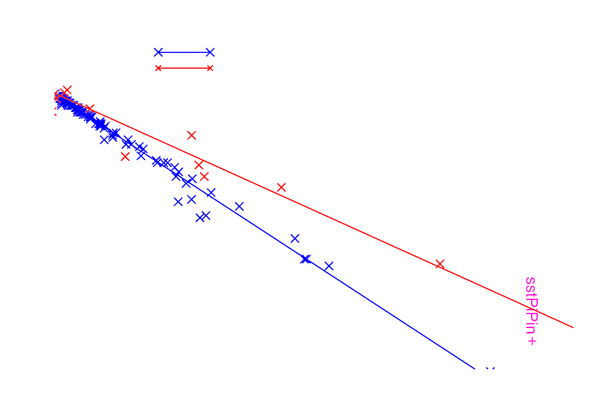

# Supplementary to: Insensitivity of global temperature response to the magnitude of volcanic eruptions

<!-- .element: style="font-size:50pt" -->

_In EGU session __"Understanding volcano-climate impacts and the stratospheric aerosol
layer"___

<!-- .element: style="font-size:18pt" -->

Notes:

Hi, and thanks for showing up to my talk here today. My name is Eirik Enger, and I'm a
PhD candidate at UiT the Arctic University of Norway. My work focus on how volcanoes
affect climate, and today we will look at "Insensitivity of global temperature response
to the magnitude of volcanic eruptions".

---

## Motivation

See to the abstract, pull out some of it to mention here.

<!-- .slide: data-background-color="#001928" -->
<!-- .slide: data-visibility="hidden" -->

Notes:

The reason we are visiting this topic is that there have been several attempts to do
[this], many of which focus on or assume [something about linearity maybe].

--

<!-- .slide: data-background-color="#001928" -->

Figure from [Gregory et al. (2016)](https://doi.org/10.1007/s00382-016-3055-1)

<!-- .element: style="font-size:13pt" -->

<!-- .element: class="r-stretch" -->

So, $M\_\{k,\\,\mathrm\{AOD\}\}^\max\propto M\_\{k,\\,\mathrm\{TOA\}\}^\max$?

<!-- .element: class="fragment" -->

Notes:

This plot is from Gregory et al. (2016), and it's showing radiative forcing against
aerosol optical depth. Two simulations were done by the authors using the HadCM3 climate
model, one simulation by [Andrews (2014)](http://dx.doi.org/10.1175/JCLI-D-13-00336.1)
used the HadGEM2 climate model while the AR5 data points are from a time series from the
Fifth Assessment report of the IPCC (intergovernmental panel on climate change).

This show a proportionality between annual mean values of AOD and radiative forcing, but
only for AOD values up to 0.15, roughly equivalent to the peak of the 1991 Mt. Pinatubo
eruption. Whether this property holds as one goes to much greater values, for example
comparable to the Young Toba Tuff eruption 74ky ago, is of interest to us. Such a super
volcano would have roughly one hundred times the AOD values as Mt. Pinatubo, but
previous simulations indicate radiative forcing values that are only about twenty times
that of Mt. Pinatubo. Is this because the linearity does not hold for this large values,
or is it a shortcoming on the model's side?

Can we make a similar comparison of the peak values, for example in daily resolution (as
opposed to averaging over the whole year before comparing)?

Plot from [Gregory et al. (2016)](https://doi.org/10.1007/s00382-016-3055-1), figure 4.

--

<!-- .slide: data-background-color="#001928" -->

<!-- .slide: data-visibility="hidden" -->

From Gregory et al. (2016):

> It would be useful for investigation of volcanic forcing and feedback in CMIP6 if
> ensemble experiments were conducted with historical volcanic aerosol as the only
> forcing agent in each AOGCM, to diagnose the climate response, and with the
> corresponding AGCMs with prescribed sea surface conditions, to diagnose the radiative
> forcing. This would reveal whether other models also exhibit a cloud adjustment and a
> lower climate sensitivity for volcanic forcing, and offer the opportunity for analysis
> of the processes involved.

<!-- .element: style="font-size:20pt" -->

Expect $M\_\{k,\\,\mathrm\{AOD\}\}^\max\propto
M\_\{k,\\,\mathrm\{TOA\}\}^\max,\\,\mathrm{AOD}\in (0,0.15)$

<a href="https://doi.org/10.1007/s00382-016-3055-1"
data-citation-key="@gregory2016">Gregory et al. (2016)</a>

<!-- .element: style="font-size:13pt" -->

Notes:

One note to make about the AOD and radiative imbalance is that they are often assumed as
being proportional, with a proportionality constant of 25 estimated in the AR5.

--

<!-- .slide: data-background-color="#001928" -->

Using a linear operator to describe temperature fluctuations:

$$
\Delta T(t)=\hat{L}[f_K(t)]
$$

$$
\Delta T(t)=\phi\ast f_K(t)=\phi\ast\sum_k A_k\delta(t-t_k)
$$

<!-- .element: class="fragment" -->

Notes:

Previous efforts of estimating a temperature response function from forcing data have
often been to use a linear operator to describe temperature fluctuations in response to
a forcing. Some studies also assume the forcing from different agents to be similar,
although this have been disputed by several studies.

The equation is depicting the linear relation between some forcing 𝑓(𝑡) and the
deterministic temperature fluctuation due to the forcing.

We wish to look further into the linearity assumption in relation to volcanoes over a
large range of eruption magnitudes. With magnitude, we here mean the total sulphur
aerosol mass.

In particular; is it reasonable to write up the temperature response to volcanic
eruptions as a convolution between the forcing and some general shape function, here
represented by the letter 𝜙.

The forcing is here consisting only of forcing due to episodic volcanoes, where 𝐴
represent the amplitude of a given volcanic event arriving at time 𝑡_𝑘.

--

<!-- .slide: data-background-color="#001928" -->
<!-- .slide: data-background-size="contain" -->
<!-- .slide: data-background="./attachments/egu2023/ens-plts/temperature-all-strengths.webp" -->

--

<!-- .slide: data-background-color="#001928" -->
<!-- .slide: data-background-size="contain" -->
<!-- .slide: data-background="./attachments/egu2023/ens-plts/aod-all-strengths.webp" -->

--

<!-- .slide: data-background-color="#001928" -->
<!-- .slide: data-background-size="contain" -->
<!-- .slide: data-background="./attachments/egu2023/ens-plts/toa-all-strengths.webp" -->

--

<!-- .slide: data-background-color="#001928" -->
<!-- .slide: data-background-size="contain" -->
<!-- .slide: data-background="./attachments/egu2023/double-overlap-superpose.webp" -->

Notes:

Results from running CESM2(WACCM6) with a 400 Tg volcanic event occurring once (Single
event, orange) and occurring twice four years apart (Double event, blue). "Superposed"
in green is two copies of the single event superposed. The single event is copied and
shifted in time, where the shadings mark the two regions of the single events.

The volcano erupted on 15. February 1853 and on the same day in 1857, located at the
equator (1 degree east).

From this initial simulation of overlapping pulses, the superposing of temperature
responses is relatively good, motivating further analysis of the linearity (or lack
thereof) of the temperature response.

--

<!-- .slide: data-background-color="#001928" -->
<!-- .slide: data-background="./attachments/egu2023/double-overlap-superpose.webp" -->
<!-- .slide: data-background-opacity="0.1" -->
<!-- .slide: data-background-size="contain" -->
<!-- .slide: data-background-repeat="no-repeat" -->

`$$
\Delta T(t)=\phi\ast f_K(t)=\phi\ast\sum_k A_k\delta(t-t_k)
$$`

`$$
A_k\left\{
\begin{aligned}
&\overset{?}{=}g(M_k^{\max})\\
&\overset{?}{=}M_k^{\max}
\end{aligned}
\right.,\,
M=\left\{
\begin{aligned}
&\mathrm{SO_2\,[Tg]}\\
&\mathrm{AOD\,[1]}\\
&\mathrm{TOA\,[W/m^2]}
\end{aligned}
\right.
$$`

<!-- .element: class="fragment" data-fragment-index="1" -->

where `$M_k^{\max}$` is the peak magnitude of event `$k$`.

<!-- .element: class="fragment" data-fragment-index="1" -->
<!-- .element: style="font-size:20pt" -->

Notes:

The question then become, can we convolve a general response function with some forcing
representation to obtain temperature fluctuations? Or do we perhaps need a non-linear
transformation of the forcing to be able to get temperature from convolutions?

We consider three different sources to describe the forcing; total injected SO2 in Tg,
the aerosol optical depth and forcing as top-of-the-atmosphere radiative imbalance.

(Injected SO2 is used as model input to simulate the volcanoes, while both AOD and
radiative imbalance are output variables of the model.)

---

## Results

<!-- .slide: data-visibility="hidden" -->

--

_Legend description for the forthcoming figures._

<!-- .element: style="font-size:20pt" -->

| Short Name | Long Name                    |
| :--------- | :--------------------------- |
| C2W        | CESM2(WACCM6)                |
| C2WN       | CESM2(WACCM6), high latitude |
| C2C        | CESM2(CAM6)                  |
| C1C        | CESM1(CAM5)                  |
| P          | Pinatubo, observational      |
| P100       | 100 times Pinatubo           |
| V1         | VolMIP, version 1            |
| V2         | VolMIP, version 2            |

<!-- .element: class_="fragment animated move-to scale-down" data-animated-move-to-left="-15vw" data-animated-move-to-top="10vh" -->
<!-- .element: style="font-size:15pt" -->

Notes:

We have run the CESM2 as an AOGCM and AGCM with constant SST conditions with made up
volcanic eruptions of three different sizes:

- the smallest volcano is comparable to the Mt. Pinatubo eruption
- the largest volcano is comparable to the Young Toba Tuff eruption (i.e., roughly 100
  times Mt. Pinatubo)
- the third sits in the middle between the two extremes.

--

<!-- .slide: data-visibility="hidden" -->
<!-- .slide: data-background-size="contain" -->
<!-- .slide: data-background="./attachments/egu2023/ens-plts/injection_vs_temperature.webp" -->

Notes:

Temperature anomaly against injected SO2.

Note that the green asterisk, C2C, is NOT part of the inset, but has the same AOD value
as the orange circle (C2WN), and the most extreme C2W point.

| Short Name | Long Name                    |
| :--------- | :--------------------------- |
| C2W        | CESM2(WACCM6)                |
| C2WN       | CESM2(WACCM6), high latitude |
| C2C        | CESM2(CAM6)                  |
| C1C        | CESM1(CAM5)                  |
| P          | Pinatubo, observational      |
| P100       | 100 times Pinatubo           |
| V          | VolMIP                       |

--

<!-- .slide: data-visibility="hidden" -->
<!-- .slide: data-background-size="contain" -->
<!-- .slide: data-background="./attachments/egu2023/ens-plts/injection_vs_temperature_logscale.webp" -->

Notes:

Same as the previous: temperature anomaly against injected SO2, but on a logarithmic
axis for the injected SO2.

| Short Name | Long Name                    |
| :--------- | :--------------------------- |
| C2W        | CESM2(WACCM6)                |
| C2WN       | CESM2(WACCM6), high latitude |
| C2C        | CESM2(CAM6)                  |
| C1C        | CESM1(CAM5)                  |
| P          | Pinatubo, observational      |
| P100       | 100 times Pinatubo           |
| V          | VolMIP                       |

--

<!-- .slide: data-visibility="hidden" -->
<!-- .slide: data-background-size="contain" -->
<!-- .slide: data-background="./attachments/egu2023/ens-plts/injection_vs_aod.webp" -->

Notes:

Injection versus aerosol optical depth

| Short Name | Long Name                    |
| :--------- | :--------------------------- |
| C2W        | CESM2(WACCM6)                |
| C2WN       | CESM2(WACCM6), high latitude |
| C2C        | CESM2(CAM6)                  |
| C1C        | CESM1(CAM5)                  |
| P          | Pinatubo, observational      |
| P100       | 100 times Pinatubo           |
| V1         | VolMIP, version 1            |
| V2         | VolMIP, version 2            |

--

<!-- .slide: data-visibility="hidden" -->
<!-- .slide: data-background-size="contain" -->
<!-- .slide: data-background="./attachments/egu2023/ens-plts/injection_vs_aod_logscale.webp" -->

Notes:

Injection versus aerosol optical depth on log-log axis

| Short Name | Long Name                    |
| :--------- | :--------------------------- |
| C2W        | CESM2(WACCM6)                |
| C2WN       | CESM2(WACCM6), high latitude |
| C2C        | CESM2(CAM6)                  |
| C1C        | CESM1(CAM5)                  |
| P          | Pinatubo, observational      |
| P100       | 100 times Pinatubo           |
| V1         | VolMIP, version 1            |
| V2         | VolMIP, version 2            |

--

<!-- .slide: data-background-size="contain" -->
<!-- .slide: data-background="./attachments/egu2023/ens-plts/aod_vs_temperature.webp" -->

Notes:

Aerosol optical depth versus temperature

| Short Name | Long Name                    |
| :--------- | :--------------------------- |
| C2W        | CESM2(WACCM6)                |
| C2WN       | CESM2(WACCM6), high latitude |
| C2C        | CESM2(CAM6)                  |
| C1C        | CESM1(CAM5)                  |
| P          | Pinatubo, observational      |
| P100       | 100 times Pinatubo           |
| V1         | VolMIP, version 1            |
| V2         | VolMIP, version 2            |

--

<!-- .slide: data-background-size="contain" -->
<!-- .slide: data-background="./attachments/egu2023/ens-plts/aod_vs_temperature_logscale.webp" -->

Notes:

Aerosol optical depth versus temperature on semilog-x axis

| Short Name | Long Name                    |
| :--------- | :--------------------------- |
| C2W        | CESM2(WACCM6)                |
| C2WN       | CESM2(WACCM6), high latitude |
| C2C        | CESM2(CAM6)                  |
| C1C        | CESM1(CAM5)                  |
| P          | Pinatubo, observational      |
| P100       | 100 times Pinatubo           |
| V1         | VolMIP, version 1            |
| V2         | VolMIP, version 2            |

--

<!-- .slide: data-background-size="contain" -->
<!-- .slide: data-background="./attachments/egu2023/ens-plts/injection_vs_toa.webp" -->

--

<!-- .slide: data-background-size="contain" -->
<!-- .slide: data-background="./attachments/egu2023/ens-plts/toa_vs_temperature.webp" -->

--

<!-- .slide: data-background-size="contain" -->
<!-- .slide: data-background="./attachments/egu2023/ens-plts/aod_vs_toa_avg.webp" -->

Notes:

Annual mean of radiative forcing against aerosol optical depth. All simulations are with
the CESM2 climate model and dynamic ocean, one was run with CAM6 while the rest was
using WACCM6 in the middle atmosphere configuration.

| Short Name | Long Name                                              |
| :--------- | :----------------------------------------------------- |
| C2W⬆️       | CESM2(WACCM6), strong eruption                         |
| C2W—       | CESM2(WACCM6), medium eruption                         |
| C2W⬇️       | CESM2(WACCM6), weak eruption                           |
| C2WN⬆️      | CESM2(WACCM6), high latitude, strong eruption          |
| C2DO—      | CESM2(WACCM6), double and overlapping, medium eruption |
| C2C⬆️       | CESM2(CAM6), strong eruption                           |

---

<!-- .slide: data-background-color="#001928" -->

### Links

<!-- FIXME: for now, I'm using an old slide as an example. Update the links! -->

_FIXME: for now, I'm using an old slide as an example. Update the links!_

<!-- .element: style="color:red" -->

The slides can be viewed both with
([html](https://slides.eirikenger.xyz/2023-01-24-midterm-evaluation-presentation),
[pdf](https://raw.githubusercontent.com/engeir/presentations-files/main/2022/chess-am/poster.pdf))
and without
([html](https://slides.eirikenger.xyz/2023-01-24-midterm-evaluation-presentation?showNotes=true),
[pdf](https://raw.githubusercontent.com/engeir/presentations-files/main/2022/chess-am/poster.pdf))
speaker notes.

[Link](https://meetingorganizer.copernicus.org/EGU23/EGU23-3331.html) and QR code to the
conference abstract information:

<!-- Start adding with revealjs-make-reflist -->
<!-- Generated by revealjs-make-reflist. Do not edit. -->

---

## References

- <!-- .element: style="font-size:20pt" -->

Gregory, J. M., T. Andrews, P. Good, T. Mauritsen, and P. M. Forster. 2016. “Small Global-Mean Cooling Due to Volcanic Radiative Forcing.” <em>Climate Dynamics</em> 47 (12): 3979–91. <a href="https://doi.org/10.1007/s00382-016-3055-1">https://doi.org/10.1007/s00382-016-3055-1</a>.

<!-- End adding with revealjs-make-reflist -->
