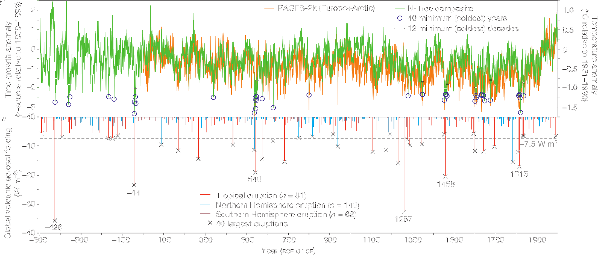

<!--
Color is from https://uit.no/ressurs/uit/profil2019/examples/fargekart.png, but at a
darker luminosity.
-->

~~Insensitivity of global temperature response to the magnitude of volcanic eruptions~~

# Aerosol optical depth dependency from large volcanic eruptions

<!-- .element: style="font-size:50pt" -->

_[**Eirik Rolland Enger**](mailto:eirik.r.enger@uit.no), Audun Theodorsen, Maria
Rugenstein, Rune Graversen_

<!-- .element: style="font-size:18pt" -->

Notes:

My name is Eirik Enger, and I'm a PhD candidate at UiT the Arctic University of Norway.
My work focus on how volcanoes affect climate, and today we will look at "Aerosol
optical depth dependency from large volcanic eruptions".

_(The abstract has the title "Insensitivity of global temperature response to the
magnitude of volcanic eruptions", but the contents of this talk has been adjusted
somewhat since the submission)._

--

<!-- .slide: data-visibility="hidden" -->

## Background

--

Volcanic eruptions are short-lived and results in
large perturbations in global mean surface
temperature.

Notes:

Why volcanoes? Their impact on temperature is easy to see in the background noise; large
volcanic eruptions leave a short-lived but big perturbation of the global mean
temperature.

--

_Figure from
<a href="https://doi.org/10.1038/nature14565" data-citation-key="@sigl2015">Sigl et al.
(2015)</a>_

<!-- .element: style="font-size:13pt" -->

Notes:

This figure is from
<a href="https://doi.org/10.1038/nature14565" data-citation-key="@sigl2015">Sigl et al.
(2015)</a>, and is showing global volcanic aerosol forcing and Northern Hemisphere
temperature variations over the last $2500$ years.

One can clearly spot the impact on temperature the largest volcanic eruptions had,
giving temperature perturbations well above the noise floor. The temperature then
reverts to its equilibrium state within few years.

---

## Motivation

<!-- .slide: data-background-color="#001928" -->
<!-- .slide: data-visibility="hidden" -->

--

<!-- .slide: data-background-color="#001928" -->

_Figure from
<a href="https://doi.org/10.1007/s00382-016-3055-1" data-citation-key="@gregory2016">Gregory
et al. (2016)</a>_

<!-- .element: style="font-size:13pt" -->

<!-- .element: class="r-stretch" -->

Notes:

This plot is from [Gregory et al. (2016)](https://doi.org/10.1007/s00382-016-3055-1),
and it's showing radiative forcing against aerosol optical depth, where radiative
forcing is a measure of the energy imbalance of the Earth and AOD is a measure of the
opacity of the stratosphere
([Marshall et al. 2020](https://doi.org/10.1029/2020GL090241)) (also from
[Niemeier and Schmidt (2017)](10.5194/acp-17-14871-2017), "a measure of turbidity and
degradation of sunlight"). Two simulations were done by the authors using the HadCM3
climate model, one simulation by
[Andrews (2014)](http://dx.doi.org/10.1175/JCLI-D-13-00336.1) used the HadGEM2 climate
model while the AR5 data points are from the Fifth Assessment report of the IPCC
(intergovernmental panel on climate change). Gradient lines have slopes of -26.6, -24.6,
-19, -17.

This show a proportionality between annual mean values of AOD and radiative forcing, but
only for AOD values up to 0.15, roughly equivalent to the peak of the 1991 Mt. Pinatubo
eruption. Whether this property holds as one goes to much greater values, for example
comparable to the Young Toba Tuff eruption 74ky ago, is of interest to us. Such a super
volcano would have roughly one hundred times the AOD values as Mt. Pinatubo, but
previous simulations indicate radiative forcing values that are only about twenty times
that of Mt. Pinatubo. Is this because the linearity does not hold for this large values,
or is it a **shortcoming on the model's side**?

Can we make a similar comparison of the peak values, for example in daily resolution (as
opposed to averaging over the whole year before comparing)?

> Plot from [Gregory et al. (2016)](https://doi.org/10.1007/s00382-016-3055-1),
> figure 4.

--

<!-- .slide: data-background-color="#001928" -->

### Simulations

- CESM2 (Community Earth System Model, version 2.1.3)
  <!-- .element: class="fragment" -->
- WACCM6 atmosphere <!-- .element: class="fragment" -->
- Dynamic ocean and prescribed sea-surface temperature conditions (AOGCM & AGCM)
  <!-- .element: class="fragment" -->

Notes:

Simulations are carried out with the Community Earth System Model, version 2.1.3, and
using the WACCM6 high-top atmosphere component, specifically in a nominal two degree
resolution and the "middle atmosphere" component setting. Both simulations with a
dynamic ocean (i.e., running the model as an AOGCM) and prescribed sea-surface
temperature conditions (i.e., a AGCM) have been done.

--

<!-- .slide: data-background-color="#001928" -->
<!-- .slide: data-background-size="contain" -->
<!-- .slide:
data-background="https://raw.githubusercontent.com/engeir/presentations/dd0a662/2023/egu23/assets/temperature-all-strengths.webp"
-->

Notes:

We here see the three main simulations that have been run, of individual volcanic
eruptions at the equator with three different magnitudes defined by inputting different
amounts of SO2 into the atmosphere.

We are specifically looking at the temperature response from the three different
eruption magnitudes, where the notation of a downward arrow, horizontal line and upward
arrow will be used to indicate the different magnitudes of a weak, medium and strong
eruption, respectively.

--

<!-- .slide: data-state="blur" -->
<!-- .slide: data-background-color="#001928" -->
<!-- .slide: data-background-size="contain" -->
<!-- .slide:
data-background="https://raw.githubusercontent.com/engeir/presentations/dd0a662/2023/egu23/assets/temperature-all-strengths.webp"
-->
<!-- .slide: data-background-opacity="0.15" -->

- At the equator
- <!-- .element: class="fragment" data-fragment-index="1" -size:29pt" --> $\mathrm{SO_2}$ injected at $18$–$20$
  `$\mathrm{km}$` altitude
- <!-- .element: class="fragment" data-fragment-index="2" -size:29pt" --> $\mathrm{SO_2}$ amounts:
  - `$26\,\mathrm{Tg}$`(↓)
  - `$400\,\mathrm{Tg}$`(—)
  - `$1629\,\mathrm{Tg}$`(↑)

> Tg = tera gram = Mt = mega tons = $10^{12}$ grams

<!-- .element: style="font-size:20pt" -->
<!-- .element: class="fragment" data-fragment-index="2" -->

Notes:

The volcanoes were created from an equatorial eruption, with the SO2 injected between 18
and 20 km altitude. The amounts of injected SO2 were 26 Tg (similar to Mt. Pinatubo),
400 Tg (similar to the 1257 Samalas eruption) and 1629 Tg (same order of magnitude as
Young Toba Tuff ~74 ky ago) of SO2 into the atmosphere between 18 and 20 km height.

> Tg = tera gram = Mt = mega tons = 1e12 grams

--

<!-- .slide: data-visibility="hidden" -->
<!-- .slide: data-background-color="#001928" -->
<!-- .slide: data-background-size="contain" -->
<!-- .slide:
data-background="https://raw.githubusercontent.com/engeir/presentations/dd0a662/2023/egu23/assets/double-overlap-superpose.webp"
-->

Notes:

Let us say we take the medium-sized volcano and let it erupt twice with four years
apart. This is what we see here in blue, with two copies of the medium-sized volcano
shown in orange, aligned so that the eruptions occur at the same time (the shadings mark
the two regions of the single events). Superposing the two orange individual eruption
time series gives the green time series.

The volcano erupted first on 15. February 1853 and then on the same day in 1857.

From this initial simulation of overlapping pulses, the superposing of temperature
response is relatively good, motivating further analysis of the linearity (or lack
thereof) of the temperature response. From this alone one might expect that temperature
does indeed respond linearly to _some representation_ of the radiative forcing.

---

## Results

<!-- .slide: data-visibility="hidden" -->

--

_Legend description for the forthcoming figures._

<!-- .element: style="font-size:20pt" -->
<!-- .slide: data-visibility="hidden" -->

| Short Name | Long Name                             |
| :--------- | :------------------------------------ |
| C2W        | CESM2(WACCM6)                         |
| C2WN↑      | CESM2(WACCM6), high latitude, north   |
| C2WDO—     | CESM2(WACCM6), double and overlapping |
| P          | Pinatubo                              |
| P100       | Pinatubo times 100                    |
| T          | Tambora                               |

<!-- .element: class_="fragment animated move-to scale-down"
data-animated-move-to-left="-15vw" data-animated-move-to-top="10vh" -->
<!-- .element: style="font-size:15pt" -->

Notes:

We have run the CESM2 as an AOGCM and AGCM with prescribed SST conditions with made up
volcanic eruptions of three different sizes:

- the smallest volcano is comparable to the Mt. Pinatubo eruption
- the intermediate volcano is comparable to the Samalas eruption
- the largest volcano is comparable to the Young Toba Tuff eruption (i.e., roughly 100
  times Mt. Pinatubo)
- the third sits in the middle between the two extremes.

--

<!-- .slide: data-visibility="hidden" -->
<!-- .slide: data-background-size="contain" -->
<!-- .slide:
data-background="https://raw.githubusercontent.com/engeir/presentations/dd0a662/2023/egu23/assets/aod_vs_temperature_logscale.webp"
-->

Notes:

Aerosol optical depth versus temperature on semilog-x axis.

This plot is showing the peak values of the three individual CESM2(WACCM6) runs, as well
as data from the Mount Pinatubo eruption, Pinatubo times 100 simulation and Mount
Tambora eruption.

The C2W temperature data show close to logarithmic dependence on AOD, while data from
other sources than CESM2 fall slightly off this, with especially the Pinatubo times 100
simulation having a large temperature response.

| Short Name | Long Name          |
| :--------- | :----------------- |
| C2W        | CESM2(WACCM6)      |
| P          | Pinatubo           |
| P100       | Pinatubo times 100 |
| T          | Tambora            |

> **Pinatubo** AOD data from
> <a href="https://doi.org/10.5194/gmd-11-2633-2018" data-citation-key="@sukhodolov2018">Sukhodolov
> et al. (2018)</a>, temperature from
> <a href="https://doi.org/10.1029/1999JD900835" data-citation-key="@hansen1999">Hansen
> et al. (1999)</a>. **Pinatubo times 100** AOD and temperature data from
> <a href="https://doi.org/10.1007/s00382-005-0066-8" data-citation-key="@jones2005">Jones
> et al. (2005)</a>. **Tambora** AOD data from
> <a href="https://doi.org/10.5194/essd-9-809-2017" data-citation-key="@toohey2017">Toohey,
> M. and Sigl, M. (2017)</a>, temperature from
> <a href="https://doi.org/10.1002/wcc.407" data-citation-key="@raible2016">Raible et
> al. (2016)</a>.

--

<!-- .slide: data-visibility="hidden" -->
<!-- .slide: data-background-size="contain" -->
<!-- .slide:
data-background="https://raw.githubusercontent.com/engeir/presentations/dd0a662/2023/egu23/assets/aod_vs_temperature.webp"
-->

Notes:

Plotting this on linear axis makes it more clear that the biggest outlier is the
Pinatubo times 100 simulation, while the Pinatubo and Tambora data lie close to the
weakest CESM2 simulation.

A similar plot can be made with temperature anomaly against injected SO2 (input field to
the CESM2 simulations), but this is not shown here since it is close to a simple scaling
of the x-axis.

> The "temperature-versus-SO2"-plot and similar plots can be viewed in the
> [supplementary](https://meetingorganizer.copernicus.org/EGU23/EGU23-3331.html).

| Short Name | Long Name          |
| :--------- | :----------------- |
| C2W        | CESM2(WACCM6)      |
| P          | Pinatubo           |
| P100       | Pinatubo times 100 |
| T          | Tambora            |

> **Pinatubo** AOD data from
> <a href="https://doi.org/10.5194/gmd-11-2633-2018" data-citation-key="@sukhodolov2018">Sukhodolov
> et al. (2018)</a>, temperature from
> <a href="https://doi.org/10.1029/1999JD900835" data-citation-key="@hansen1999">Hansen
> et al. (1999)</a>. **Pinatubo times 100** AOD and temperature data from
> <a href="https://doi.org/10.1007/s00382-005-0066-8" data-citation-key="@jones2005">Jones
> et al. (2005)</a>. **Tambora** AOD data from
> <a href="https://doi.org/10.5194/essd-9-809-2017" data-citation-key="@toohey2017">Toohey,
> M. and Sigl, M. (2017)</a>, temperature from
> <a href="https://doi.org/10.1002/wcc.407" data-citation-key="@raible2016">Raible et
> al. (2016)</a>.

--

<!-- .slide: data-background-size="contain" -->
<!-- .slide:
data-background="./tmp/aod_vs_toa_avg_inset_sparse.webp"
-->

Notes:

Similar plot to the one shown from
[Gregory et al. (2016)](https://doi.org/10.1007/s00382-016-3055-1), of annual mean
radiative forcing against aerosol optical depth. This uses the same ratio on the axes,
but somewhat zoomed out.

Only the data from the simulation carried out by the authors of
[Gregory et al. (2016)](https://doi.org/10.1007/s00382-016-3055-1) is included here as
the grey x-es, which was from the HadCM3 model. The gradient lines are the same as those
from the earlier figure. We here first show the data from the smallest volcanic eruption
that we simulated (blue downward pointing triangles), which we find to be well aligned
with the data obtained by
[Gregory et al. (2016)](https://doi.org/10.1007/s00382-016-3055-1). The yellow plus-sign
show for reference the peak values after the 1815 Mt. Tambora eruption while the purple
star show the peak values after the 1991 Mt. Pinatubo eruption.

This works as a nice test that the data output from the CESM2 model is comparable with
previous results.

Let us fill out this plot more with data from the stronger volcanic eruptions as well.

| Short Name            | Long Name                                                |
| :-------------------- | :------------------------------------------------------- |
| T Peak\*              | Tambora, peak value                                      |
| C2W↓                  | CESM2(WACCM6), weak eruption                             |
| P Peak\*              | Pinatubo, peak value                                     |
| Gregory et al. (2016) | Values from HadCM3 sstPiHistvol by Gregory et al. (2016) |

--

<!-- .slide: data-background-size="contain" -->
<!-- .slide:
data-background="./tmp/aod_vs_toa_avg_inset.webp"
-->

Notes:

We now also include annual means from the medium-sized tropical eruption (orange
diamonds) and the strongest tropical eruption, in addition to annual means from a
Northern Hemisphere strong eruption (brown upward pointing tri-star) and a simulation of
two tropical eruptions that followed four years apart (red narrow diamonds).

Now we find that among the C2W data, _only the weak eruption data points_ fall below the
"-19" gradient line for AOD values of 0.1 and higher.

| Short Name            | Long Name                                                |
| :-------------------- | :------------------------------------------------------- |
| T Peak\*              | Tambora, peak value                                      |
| C2W↑                  | CESM2(WACCM6), strong eruption                           |
| C2W—                  | CESM2(WACCM6), medium eruption                           |
| C2W↓                  | CESM2(WACCM6), weak eruption                             |
| P Peak\*              | Pinatubo, peak value                                     |
| C2WN↑                 | CESM2(WACCM6), northern hemisphere, strong eruption      |
| C2WDO—                | CESM2(WACCM6), double, and overlapping, medium eruption  |
| Gregory et al. (2016) | Values from HadCM3 sstPiHistvol by Gregory et al. (2016) |

--

<!-- .slide: data-background-size="contain" -->
<!-- .slide:
data-background="./tmp/aod_vs_toa_avg_full.webp"
-->

Notes:

If we zoom out to include all data points, it is evident that the two largest eruption
simulations follow a way less steep gradient than the HadCM3 data does.

The two largest (green and orange) start off similarly, but on a loop trajectory, where
the intermediate data points loop cuts off short and thus get on average a steeper
graient than the strong eruption points (close to -10 and -4).

The points from double and overlapping simulation, shown by the red thin diamonds,
places themselves among the points coming from the medium-sized individual simulation,
as expected, and so does the data from the strong, high latitude eruption.

The peak values from the three main equatorial simulations are shown as the red circles.
The peak value from the Pinatubo times 100 simulation (from
[Jones et al. (2005)](https://doi.org/10.1007/s00382-005-0066-8)) is shown with a pink
square. While the magnitude of the radiative forcing obtained from this simulation of a
super-eruption seems to be too small when compared to the "-19" gradient line, compared
to the simulations done here with CESM2, it fits in well with how an even stronger
eruptions loop trajectory might look like.

Filling out this radiative forcing-AOD space may give a clearer answer to whether there
is a linear relation to be found, and possibly its range of validity. And even if there
is no linear relationship, the loop that is drawn out by the strongest eruption may hint
to there being different dynamical processes at play during the initial rise and the
slow decay to equilibrium when comparing radiative forcing and aerosol optical depth.

| Short Name            | Long Name                                                |
| :-------------------- | :------------------------------------------------------- |
| C2W Peaks\*           | CESM2(WACCM6), peak values                               |
| T Peak\*              | Tambora, peak value                                      |
| C2W↑                  | CESM2(WACCM6), strong eruption                           |
| C2W—                  | CESM2(WACCM6), medium eruption                           |
| C2W↓                  | CESM2(WACCM6), weak eruption                             |
| P100 Peak\*           | Pinatubo times 100, peak value                           |
| P Peak\*              | Pinatubo, peak value                                     |
| C2WN↑                 | CESM2(WACCM6), northern hemisphere, strong eruption      |
| C2WDO—                | CESM2(WACCM6), double and overlapping, medium eruption   |
| Gregory et al. (2016) | Values from HadCM3 sstPiHistvol by Gregory et al. (2016) |

> **Pinatubo times 100** AOD and temperature data from
> <a href="https://doi.org/10.1007/s00382-005-0066-8" data-citation-key="@jones2005">Jones
> et al. (2005)</a>.

--

<!-- .slide: data-background-size="contain" -->
<!-- .slide:
data-background="./tmp/aod_vs_toa_avg_loop.webp"
-->

Notes:

To look further into what is happening with the loop, we take all our simulations of
single volcanic eruptions, align then so that the eruption day is at time zero, and
compute seasonal means to increase the temporal resolution.

The data is in this case plotted with the same shape as before, but the colour now
indicate the time after the eruption. From this view, one clearly finds that the start
is the lower branch of the loop while the decay is the upper branch.

The lower branch occurs over at time of approximately $0$ to $1.2$ years after the
eruption at which point both AOD and forcing reach its peak values. From about $1.2$ to
$3$ years after the eruption the upper branch of decay occur.

This give a slight indication that the lower branch bends and therefore have a varying
ratio of forcing to AOD, while the upper branch is close to linear with a constant
ratio.

| Short Name | Long Name                                           |
| :--------- | :-------------------------------------------------- |
| C2WN↑      | CESM2(WACCM6), northern hemisphere, strong eruption |
| C2W↑       | CESM2(WACCM6), strong eruption                      |
| C2W—       | CESM2(WACCM6), medium eruption                      |
| C2W↓       | CESM2(WACCM6), weak eruption                        |

--

<!-- .slide: data-background-size="contain" -->
<!-- .slide:
data-background="./tmp/aod_vs_toa_avg_loop_ratio.webp"
-->

Notes:

We next plot the ratio of radiative forcing to AOD, and split this into before the peak
and after the peak, that is, from (after) $0$ to $1.2$ years and from (after) $1.2$ to
$3$ years.

The values on the right side give the slopes of linear fits of the data, where the pairs
of values follow the same order from top to bottom as the legend, and the upper value
within a pair represent the first time period.

There is a clear distinction between the two periods, which suggest that the dynamics
happening shortly after the eruption and during the decay phase are different.

A second feature is the smaller magnitude of ratios we get for larger eruptions, i.e.,
that the radiative forcing is smaller for the same amount of AOD the stronger the
eruption is. This reduction of forcing efficiency has been reported in different studies
before, some relating to geoengineering using aerosols to mitigate global warming
([Marshall et al. 2019](https://doi.org/10.1029/2020GL090241) and references therein).

| Short Name | Long Name                                           |
| :--------- | :-------------------------------------------------- |
| C2WN↑      | CESM2(WACCM6), northern hemisphere, strong eruption |
| C2W↑       | CESM2(WACCM6), strong eruption                      |
| C2W—       | CESM2(WACCM6), medium eruption                      |
| C2W↓       | CESM2(WACCM6), weak eruption                        |

--

<!-- .slide: data-background-size="contain" -->
<!-- .slide:
data-background="./tmp/toa_arrays_normalized.webp"
-->

Notes:

By plotting the normalized radiative forcing time series, we find them to have very
similar shapes across the whole ensemble of different strengths.

One time series break the pattern more than the rest, which is one of the two Northern
Hemisphere strong eruptions, but the general shape of the radiative forcing still is
very consistent.

--

<!-- .slide: data-background-size="contain" -->
<!-- .slide:
data-background="./tmp/aod_arrays_normalized.webp"
-->

Notes:

Looking instead at the normalized AOD time series, one thing stands out, which is that
the early phase is steeper for the weaker eruptions, but that the decay still happen at
a similar time and rate as the stronger eruptions. The weaker eruption has a longer
plateau where it peaks, making the decaying phase being mostly similar in timing to the
other eruptions AOD time series.

---

<!-- .slide: data-background-color="#001928" -->

## Links

|                                                                                                                            [Slides](https://slides.eirikenger.xyz/2023-08-10-fysikermotet?showNotes=false)                                                                                                                            |                                                                                                                        [Slides & Notes](https://slides.eirikenger.xyz/2023-08-10-fysikermotet?showNotes=separate-page)                                                                                                                        |                                                                                                                    [Fysikermøtet Abstract](https://org.uib.no/ift-posten/Fysikermoete_2023/Abstracts%20for%20Space,%20Plasma%20and%20Climate%20Physics.pdf#page=5)                                                                                                                     |
| :-----------------------------------------------------------------------------------------------------------------------------------------------------------------------------------------------------------------------------------------------------------------------------------------------------------------------------------: | :-------------------------------------------------------------------------------------------------------------------------------------------------------------------------------------------------------------------------------------------------------------------------------------------------------------------------------------------: | :------------------------------------------------------------------------------------------------------------------------------------------------------------------------------------------------------------------------------------------------------------------------------------------------------------------------------------------------------------------------------------: |
| <qr-code contents="https://slides.eirikenger.xyz/2023-08-10-fysikermotet?showNotes=false" module-color="#1c7d43" position-ring-color="#13532d" position-center-color="#70c559" mask-x-to-y-ratio="1.1" style="width: 280px; height: 280px; margin: 0em auto;">  </qr-code> | <qr-code contents="https://slides.eirikenger.xyz/2023-08-10-fysikermotet?showNotes=separate-page" module-color="#1c7d43" position-ring-color="#13532d" position-center-color="#70c559" mask-x-to-y-ratio="1.1" style="width: 280px; height: 280px; margin: 0em auto;">  </qr-code> | <qr-code contents="https://org.uib.no/ift-posten/Fysikermoete_2023/Abstracts%20for%20Space,%20Plasma%20and%20Climate%20Physics.pdf#page=5" module-color="#1c7d43" position-ring-color="#13532d" position-center-color="#70c559" mask-x-to-y-ratio="1.1" style="width: 280px; height: 280px; margin: 0em auto;">  </qr-code> |

<!-- dprint-ignore-start -->

<!-- Start adding with revealjs-make-reflist -->
<!-- Generated by revealjs-make-reflist. Do not edit. -->

---

## References

- <!-- .element: style="font-size:20pt" -->

Gregory, J. M., T. Andrews, P. Good, T. Mauritsen, and P. M. Forster. 2016. “Small Global-Mean Cooling Due to Volcanic Radiative Forcing.” <em>Climate Dynamics</em> 47 (December): 3979–91. <a href="https://doi.org/10.1007/s00382-016-3055-1">https://doi.org/10.1007/s00382-016-3055-1</a>.

- <!-- .element: style="font-size:20pt" -->

Hansen, James, Reto Ruedy, J. Glascoe, and Makiko Sato. 1999. “GISS Analysis of Surface Temperature Change.” <em>Journal of Geophysical Research: Atmospheres</em> 104 (D24): 30997–1022. <a href="https://doi.org/10.1029/1999JD900835">https://doi.org/10.1029/1999JD900835</a>.

- <!-- .element: style="font-size:20pt" -->

Jones, Gareth S., Jonathan M. Gregory, Peter A. Stott, Simon F. B. Tett, and Robert B. Thorpe. 2005. “An AOGCM simulation of the climate response to a volcanic super-eruption.” <em>Climate Dynamics</em> 25 (7): 725–38. <a href="https://doi.org/10.1007/s00382-005-0066-8">https://doi.org/10.1007/s00382-005-0066-8</a>.

- <!-- .element: style="font-size:20pt" -->

Raible, Christoph C., Stefan Brönnimann, Renate Auchmann, Philip Brohan, Thomas L. Frölicher, Hans-F. Graf, Phil Jones, et al. 2016. “Tambora 1815 as a Test Case for High Impact Volcanic Eruptions: Earth System Effects.” <em>WIREs Climate Change</em> 7 (4): 569–89. <a href="https://doi.org/10.1002/wcc.407">https://doi.org/10.1002/wcc.407</a>.

--

- <!-- .element: style="font-size:20pt" -->

Sigl, M., M. Winstrup, J. R. McConnell, K. C. Welten, G. Plunkett, F. Ludlow, U. Büntgen, et al. 2015. “Timing and Climate Forcing of Volcanic Eruptions for the Past 2,500 Years.” <em>Nature</em> 523 (7562): 543–49. <a href="https://doi.org/10.1038/nature14565">https://doi.org/10.1038/nature14565</a>.

- <!-- .element: style="font-size:20pt" -->

Sukhodolov, T., J.-X. Sheng, A. Feinberg, B.-P. Luo, T. Peter, L. Revell, A. Stenke, D. K. Weisenstein, and E. Rozanov. 2018. “Stratospheric Aerosol Evolution After Pinatubo Simulated with a Coupled Size-Resolved Aerosol–Chemistry–Climate Model, SOCOL- AERv1.0.” <em>Geoscientific Model Development</em> 11 (7): 2633–47. <a href="https://doi.org/10.5194/gmd-11-2633-2018">https://doi.org/10.5194/gmd-11-2633-2018</a>.

- <!-- .element: style="font-size:20pt" -->

Toohey, M., and M. Sigl. 2017. “Volcanic Stratospheric Sulfur Injections and Aerosol Optical Depth from 500 BCE to 1900 CE.” <em>Earth System Science Data</em> 9 (2): 809–31. <a href="https://doi.org/10.5194/essd-9-809-2017">https://doi.org/10.5194/essd-9-809-2017</a>.

<!-- End adding with revealjs-make-reflist -->
